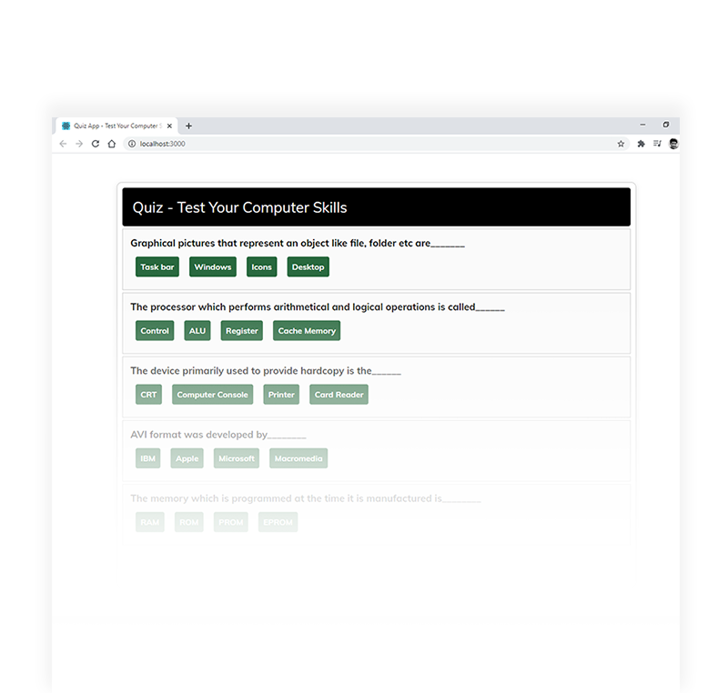

<h1 align="center">React Quiz App</h1>

## General info

Quiz App made with React.

#### [Live Site](https://sunil-pradhan.github.io/react-quiz-app)

## Screenshots

 

  

## Technologies used

- React
- Font - Google font 

## Functionalities

* Random five questions appear which changes automatically every reload of the page
* After taking quiz it shows you the result as well as play again button 

## License

This project is licensed under the MIT License.
